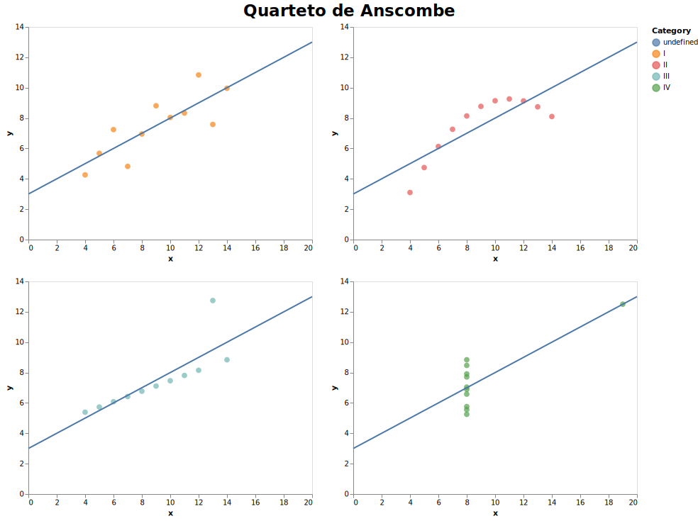
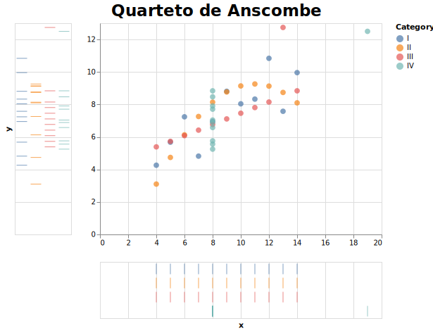

# Visualização da Informação - Fernando Hannaka

Este trabalho faz parte do curso de Visualização da Informação do EMAp da FGV.

## Aula 2 - Criar a visualização do Quarteto de Anscombe

A ferramenta escolhida para criar as visualizações foi o Altair em Python. Eu tenho mais fluência na utilização do R, usei uma vez o Altair porém foi baseado em um código template, portanto escolhi esta ferramenta para testar fazer visualizações do zero e aumentar minhas habilidades em programação.

### Dados

Os dados foram obtidos do [site da Wikipedia](https://pt.wikipedia.org/wiki/Quarteto_de_Anscombe) e transformados no [formato em csv](https://github.com/fehann/VisEMAp2020/blob/master/Anscombe.csv).

### Visualização padrão

O primeiro passo foi recriar a visualização padrão do quarteto. Uma dificuldade maior nesta parte foi encontrar a maneira de plotar a linha de regressão pois em um primeiro momento não funcionou. Após várias buscas encontrei a solução que é a utilização de layers para plotar um gráfico sobre o outro.



### Visualização interativa

Esta visualização interativa permite selecionar cada categoria separadamente e visualizar como os pontos diferem em relação aos outros conjuntos de dados. Foi adicionado também gráficos auxiliares nos eixos x e y mostrando o posicionamento dos pontos em cada eixo por categoria. É interessante que pela visualização fica claro que em quase todas as categorias, exceto a IV, todos os pontos estão na mesma coordenada x, o que difere é o posicionamento no eixo y onde as suas variações resultam na linha de regressão linear ser as mesmas para todas.


 
 [Clique para abrir no Vega](https://vega.github.io/editor/#/url/vega-lite/N4KABGBEDGD2B2AzAlgc0gLjKCFIDdkBTAd02xgQBdl4BXWOgZwHVkATKgC3IBYAGfgBooceDXqMmACSJouVcgGZBAXyHhckGlQA2RcsEgBDeNC6wATuUgBbDu32QRkRNQDKyAF4GsAJiVVTXVNSC4xaGNFLABtTQgcXDxbY0sAaxsaaAyNJLwiM1h2WnQsRLzRWF0rQ3iKyvhimgRa+rztAE8AB18oeFh7eGNdZzq212JddhsAYSiiVCsO0bakyCYifWhm+BsNraorfgBGADZIMbyQ1ah8YbpeyF15KlRLImXLiGv6yAAPVqrTo9Gz9QbDFZA4x-ZBMQyQdgDYy0ciIYYbFy6YwAI02cKwaN0GKgWTS+LAhI2P3GKE20ywkDmVAWS0h4x0TgZFza1PayzKXy0VG6jwAjnRTDoosh8AZclCYeSjIiUiiCeiiJicXjURqXKTyZSiLyKhM6TZPjzLiaoPsiNtkC0yutNvbDpYTudncKQQymCUnC5aVNyTFGfNFpZlgBdVRBJK88pafARKLkOJtJOmlLpeE+x7QZCWaCB23eXqnfg2tYFODFeClbCCtZwarWAU3FsIJqO3YdztrfOgga0CHygd4YP0qBMllRtkTl0HXt7V3bI5nbkT6u-O66B42Z6oBRvD5bm47tYA70imziyXIKjS2XOKBTmwA-WPzlQSCXrT8hQQ4Mve4iPs+cpvpM06QMsX56I8f7NmA-5Lm6K79jcaHrh6m43r6ZYNqWZohum4bMpGMbxqs1EVDuWbtDmGQMqSC6mrWRQlICWGtjUmGdpQjSPhhTYTkKt4MmCo4jOOi7vgys6UWxAl2g6Tq2mu7qeuenb-mse4HgyR4nu8lq6bJ4zXqJi7AVAoFSjQL4WQqsLwiqyJ9hSepQFiuJErqRKaiSyDZIaGp6Vo8lQACyHfM5pqAQx7ISX0I5DDJsVaNCrnOu5apeYFWp+WFhXBaFAVUvFvxReRc5wZleAcohmW0fUqGqTs3FAh1G5ekBKXrAGkEkewoa1UpsbIa1CaXNGdTUdG8oIlExjwkMtiPOwK0ALQABy7X4u1KNi7B+McACs51KEQu2IOdxzHEdACc9rQMcxgAOy7dil1+H+S1NTYACKEqWMyhxgOwRBgAAgvATBwLYuKQpAAAkCNcEQKQ2AoVBdEwGAAPSE7KqDGAAdKgj5cHQ2Lk46hMY1jxgkwsxjbc8zIk7w5O7eTxzkwAVkwLRLVtT4bFQSp1MtT57QdR0nWdl3Xbd92PUoL3QG9n3fb96aXEYimsgyACSr7-OQxzCFAgF8-wvA2kbEYm1A5suFZu0uIBpzk0951O+NruQO70VW0o3vkB95PnbtgfG-OZsW1ZT2R1gfO7cc8cu4nbvJ1bxxp2AfNKIEznOxRweh5bWDHLwRdPX7pzZ5Xuch-nWCnEX0d+I75dB231dWfXtt8OTfjN-3CeAe3HtW34RfW7zfeGwPM9D1HRc8wdLd1TYG9YOdRfneTpxx1POfrwfYDWw3-MrxUFd72b19e6P6f37vSkvx3N8R+-xdyYfQfnkJ+383bX1TgAvmH0PpfyrtfB6d8J7wMHogkesFyB8yzhfVuV9f5dwAb7Y4ZdV7T33tfDBgElD81QfguetcF4AMbiQuhFDf4fW7uPSeZDL7sIYWAI+ACebALYS-RBNtMFYGjrwHhj814UNfkXX2sCxEQMQf-KRN8-BAJAUkMBCDIFcIemokOptEGFwAdHTOpjzHoKLhnPRuADFoOvoQrRvt+Dn14XgxRv8qHkBPprWx5jf7HCYVo7BAdcHP3URw5R5NeB+BCdfIRWiT4fVIfI8hZsABqv834eJjt47JfC8kFOPkAuRoCFHlIEYUwC0cPo4J8bEkO+T6kOOXrYjpYd05dN4HAmJ4D2kVKseTB2PSxnpPHtE1pIzTa9JrjfKBWjwkxymZ0gBJ9zrVP0bUt2SzPZcKei00pvi6l9OLgk3aT1WpzW+CAVQQA/view)

Segue abaixo o código para esta visualização interativa. Foi necessário usar o *selection* para permitir selecionar cada categoria separadamento, assim como o eixo *tick_axis* para plotar os gráficos auxiliares nos eixos x e y.

```markdown

# Configure the options common to all layers
brush = alt.selection_single(fields=['Category'])
base = alt.Chart(df).add_selection(brush)

# Configure the points
points = base.mark_circle(size=60).encode(
    x=alt.X('x', title=''),
    y=alt.Y('y', title=''),
    color=alt.condition(brush, 'Category', alt.value('lightgrey'))
)

# Configure the ticks
tick_axis = alt.Axis(labels=False, domain=False, ticks=False)

x_ticks = base.mark_tick().encode(
    alt.X('x', axis=tick_axis),
    alt.Y('Category', title='', axis=tick_axis),
    color=alt.condition(brush, 'Category', alt.value('lightgrey'))
)

y_ticks = base.mark_tick().encode(
    alt.X('Category', title='', axis=tick_axis),
    alt.Y('y', axis=tick_axis),
    color=alt.condition(brush, 'Category', alt.value('lightgrey'))
)

# Build the chart
finalcombo = y_ticks | (points & x_ticks)

finalcombo.properties(
    title='Quarteto de Anscombe'
).configure_title(
    fontSize=23,
    anchor='middle'
)

```

Para ver o código completo [clique aqui para ver o Jupyter notebook](https://github.com/fehann/VisEMAp2020/blob/master/Aula_2_Anscombe_Fernando.ipynb).

---

Atualizado em: 25/09/2020
